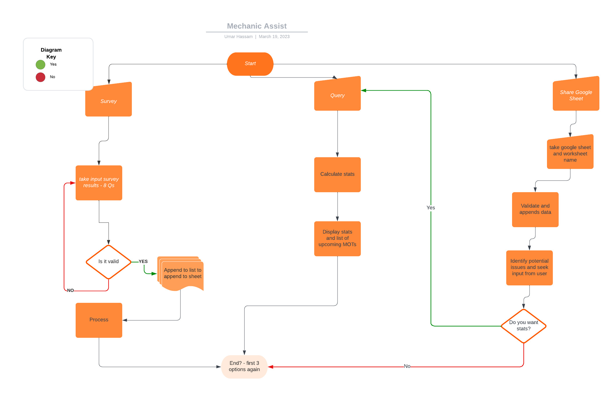

## Features

 I conect to a google sheet called. 'Mechanic-Customers', there is a tab/sheet called 'Customer-Information'. The data is in columns headed: Name Phone Make Model Age Mileage Next MOT due Booked Y/N. I want a user to be choose whether they are inputting one ata time, sharing a google sheet, or querying the information. I want to validate each input. And I want to show the user most popular car make and most popular model and average age and mileage. I also want the user to see a list of MOTs due in 6 weeks that are not yet booked and be able to input any they book

## Testing

Tested and passed through CI Python Linter

Also passed input tests

## Deployment

Deployed to Heroku using love sandwiches instructions

## Credits

I found the sheet to validate car make and model data against here: https://www.carmodelslist.com/car-manufacturers/